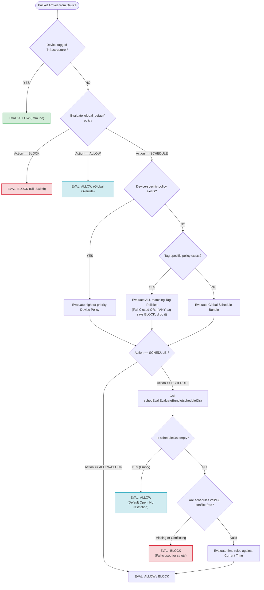

# LIAS & DIS

**LAN Internet Access Scheduler (LIAS) + Discovery Intelligence Service (DIS)**

LIAS and DIS are two independent, statically compiled Go binaries that work together to provide real-time network device discovery, deterministic device identity, and policy-based firewall scheduling for Linux networks.

---

# Architecture

## Discovery Intelligence Service (DIS)

The Discovery Intelligence Service (DIS) runs on a host with Layer-2 visibility, such as a Proxmox host, Linux bridge, or network appliance.

DIS continuously observes the network using multiple passive and active discovery providers, including:

- Netlink neighbor monitoring
- IEEE OUI vendor lookup
- Pi-hole v6 activity
- DHCP lease correlation
- mDNS (Avahi)
- SSDP / UPnP
- NetBIOS
- TLS fingerprinting
- Nmap enrichment (optional)

DIS correlates all observations into a persistent device database and exposes both:

- REST API
- Server-Sent Events (SSE)

on port **8080** for downstream consumers.

---

## LAN Internet Access Scheduler (LIAS)

LIAS runs on the VPN gateway or router.

It consumes device updates from DIS in real time through the SSE stream, evaluates policy precedence, tag memberships, schedules, and firewall policies, stores configuration in a pure-Go SQLite database, and manages an isolated **netdev** nftables table dedicated to LAN access control.

LIAS never modifies existing firewall tables, routing, NAT, VPN, or `sing-box` rules.

---

# Features

## Zero CGO

- 100% statically compiled
- `CGO_ENABLED=0`
- Supports:
  - linux/amd64
  - linux/arm64

---

## Deterministic Device Identity (PDID)

Provides persistent hardware identities that survive:

- service restarts
- IP address changes
- randomized MAC transitions (when validated)

---

## Embedded IEEE OUI Database

Includes a built-in IEEE OUI database for immediate MAC vendor identification without requiring external lookups.

---

## Isolated Netfilter Architecture

Firewall enforcement operates exclusively within:

```text
table netdev lancontrol
```

using the ingress hook on the LAN interface.

LIAS never modifies:

- filter tables
- nat tables
- routing
- policy routing
- VPN rules
- sing-box
- system nftables rules

---

## Overnight Schedule Engine

Supports schedules that span midnight.

Example:

```text
22:00 → 06:00
```

Ideal for:

- bedtime schedules
- overnight restrictions
- weekend policies

---

## Persistent Storage

Both services use embedded pure-Go SQLite databases.

DIS:

```text
/var/lib/dis/state.db
```

LIAS:

```text
/var/lib/lias/state.db
```

No external database server is required.

---

## Embedded Apple HIG Dashboard

LIAS embeds its entire web dashboard inside the executable.

The dashboard is served directly from the binary on:

```text
http://<lias-ip>:8081
```

---

# Prerequisites

- Go 1.23+
- Linux Kernel 5.10+
- nftables
- CAP_NET_ADMIN capability (LIAS)

Optional enrichment tools:

- nmap
- avahi-tools

---

# Building

Both binaries compile completely statically.

## Build for the current architecture

```bash
make build
```

## Cross-compile for Linux AMD64 and ARM64

```bash
make release
```

Compiled binaries are placed in:

```text
bin/
```

---

# DIS Configuration

**File**

```text
/etc/dis/config.yaml
```

```yaml
# ==============================================================================
# Discovery Intelligence Service (DIS) Configuration
# Version: 1.4
# File Path: /etc/dis/config.yaml
# ==============================================================================

http:
  listen: ":8080"
  auth_token: ""

discovery:
  interface: "eth0"

  netlink:
    enabled: true

  pihole:
    enabled: true
    url: "http://pi.hole"
    password: "your_pihole_password"

  dhcp:
    enabled: true
    type: "router"

    lease_file: "/tmp/dhcp.leases"

    lease_url: ""

    ssh_host: ""
    ssh_user: "root"

  enrichment:
    avahi_enabled: true
    ssdp_enabled: true
    netbios_enabled: true
    tls_enabled: true
    nmap_enabled: true
    unknown_device_scan: true
    validation_interval: "24h"

storage:
  path: "/var/lib/dis/state.db"

logging:
  level: "info"
  format: "json"
```

---

# LIAS Configuration

**File**

```text
/etc/lias/config.yaml
```

```yaml
# ==============================================================================
# LAN Internet Access Scheduler (LIAS) Configuration
# Version: 1.0
# File Path: /etc/lias/config.yaml
# ==============================================================================

http:
  listen: ":8081"

dis:
  url: "http://127.0.0.1:8080"
  auth_token: ""
  sync_interval: "30s"

nftables:
  interface: "eth0"
  table_name: "lancontrol"
  shutdown_behavior: "flush"

schedules:
  timezone: "UTC"

storage:
  path: "/var/lib/lias/state.db"

logging:
  level: "info"
  format: "json"
```

---

# Deployment

## Discovery Intelligence Service

Install the `dis` binary on:

- Proxmox host
- Linux bridge
- Router
- Layer-2 monitoring host

Copy the configuration file to:

```text
/etc/dis/config.yaml
```

Run:

```bash
./dis -config /etc/dis/config.yaml
```

---

## LAN Internet Access Scheduler

Install the `lias` binary on:

- VPN Gateway
- Router
- Firewall host

Copy the configuration file to:

```text
/etc/lias/config.yaml
```

Run:

```bash
./lias -config /etc/lias/config.yaml
```

Both services are intended to run continuously under:

- systemd
- OpenRC
- Supervisor
- another process manager

---

# Dashboard

The LIAS dashboard is fully embedded within the `lias` executable.

Open:

```text
http://<lias-ip>:8081/
```

The web interface provides:

- Real-time device discovery
- Device fingerprint information
- Tag management
- Infrastructure device management
- Multi-tag assignment
- Schedule creation
- Policy management
- Vacation Mode
- Device enable/disable
- Firewall status
- nftables synchronization status
- Real-time SSE updates
- Policy evaluation visibility
- Schedule visualization
- Device search and filtering
- Embedded Apple Human Interface Guidelines (HIG) user experience

---

# Overall Design

The architecture intentionally separates network discovery from policy enforcement.

**DIS** is responsible for:

- discovering devices
- correlating identities
- fingerprinting hardware
- enriching metadata
- exposing a real-time API

**LIAS** is responsible for:

- consuming discovery updates
- evaluating policy precedence
- enforcing schedules
- maintaining deterministic firewall state
- managing isolated nftables rules

This separation of responsibilities keeps both binaries lightweight, resource-efficient, and independently deployable while ensuring deterministic behavior and minimal CPU, memory, and disk I/O overhead.

# LIAS Multi-Schedule & Policy Management Guide

This document provides a comprehensive guide on how to use the multi-schedule policy system in LIAS (LAN Internet Access Scheduler), along with a visual reference of the policy precedence tree.

---

# Part 1: Understanding Schedules and Policies

LIAS decouples **Time Schedules** from **Access Policies**. This allows you to create modular time windows and attach them to different groups of devices.

## 1.1 Schedule Modes

When creating a schedule, you must choose a **Mode**. This determines the default behavior **outside** of the time windows you define.

### Downtime Mode

The rules you define act as **Block** windows.

Outside of these windows, traffic is **Allowed**.

**Example**

- Schedule: Bedtime
- Time: 22:00 → 06:00
- Result:
  - During the window → Internet **Blocked**
  - Outside the window → Internet **Allowed**

### Whitelist Mode

The rules you define act as **Allow** windows.

Outside of these windows, traffic is **Blocked**.

**Example**

- Schedule: Homework
- Time: 15:00 → 17:00
- Result:
  - During the window → Internet **Allowed**
  - Outside the window → Internet **Blocked**

---

## 1.2 The Multi-Schedule Advantage

Instead of trying to fit unrelated rules into a single schedule, LIAS allows multiple independent schedules to be attached to the same policy.

This provides several advantages:

- Modular schedules
- Easier maintenance
- Reusable schedules
- Automatic conflict detection
- Timeline preview before saving

The scheduler internally combines all attached schedules into one composite evaluation while ensuring conflicting rules cannot be saved.

---

# Part 2: Examples & Walkthroughs

## Example 1 — Kids Tag Group

Desired behavior:

1. Block Internet every night from **22:00–06:00**
2. Allow Internet only from **15:00–17:00** on weekdays

---

### Step 1 — Create Schedule A

**Name**

```
Bedtime
```

**Mode**

```
Downtime
```

**Days**

```
Mon Tue Wed Thu Fri Sat Sun
```

**Time**

```
22:00 → 06:00
```

**Action**

```
Block
```

---

### Step 2 — Create Schedule B

**Name**

```
Homework Allowance
```

**Mode**

```
Whitelist
```

**Days**

```
Mon Tue Wed Thu Fri
```

**Time**

```
15:00 → 17:00
```

**Action**

```
Allow
```

---

### Step 3 — Create Policy

Navigate to:

```
Policies
```

Click:

```
+ New Policy
```

### Step 1 — Target

Target Type

```
Tag Group
```

Tag

```
kids
```

Policy Name

```
Kids Internet Rules
```

---

### Step 2 — Enforcement

Action

```
Schedule-Driven
```

---

### Step 3 — Schedules

Attach

- Bedtime
- Homework Allowance

The UI automatically displays a merged timeline preview.

If any conflicting windows exist, the Save button remains disabled until the conflict is resolved.

Save the policy.

---

# Example 2 — IoT Tag Group

Desired behavior:

Completely block all IoT devices except for a firmware update window every night.

---

### Step 1 — Create Schedule

Name

```
IoT Update Window
```

Mode

```
Whitelist
```

Days

```
Sun Mon Tue Wed Thu Fri Sat
```

Time

```
02:00 → 02:30
```

Action

```
Allow
```

---

### Step 2 — Create Policy

Target

```
Tag Group
```

Tag

```
iot
```

Enforcement

```
Schedule-Driven
```

Attach

```
IoT Update Window
```

Save.

Because the schedule is Whitelist mode:

- Allowed for **30 minutes**
- Blocked for the remaining **23.5 hours**

---

# Part 3: Empty Schedule Safety Behavior

If a policy uses

```
Schedule-Driven
```

but **no schedules are attached**, LIAS defaults to:

```
ALLOW
```

This intentional **Default Open** behavior prevents accidental lockouts during initial installation.

Example:

- Install LIAS
- Global Policy = Schedule
- No schedules exist yet

Result:

```
Internet continues to work normally.
```

As soon as schedules are attached, normal enforcement begins.

---

# Part 4: Policy Precedence Tree

LIAS evaluates every packet using a strict precedence hierarchy.

The **first matching rule wins.**



---

# Breakdown of the Precedence Rules

## 1. Infrastructure Immunity (Super-Immutable)

If a device carries the **infrastructure** tag, evaluation immediately returns:

```
ALLOW
```

No global switch, tag policy, device policy, or schedule is evaluated.

Infrastructure devices can never be accidentally disconnected.

Examples include:

- Router
- Firewall
- DNS Server
- DHCP Server
- VPN Gateway
- Switch Management

---

## 2. Global Kill-Switch (BLOCK)

If the Global Policy is set to:

```
BLOCK
```

Every non-infrastructure device is immediately:

```
BLOCKED
```

No additional policy evaluation occurs.

---

## 3. Global Allow Override

If the Global Policy is:

```
ALLOW
```

Every non-infrastructure device is immediately:

```
ALLOWED
```

All schedules and tag/device rules are bypassed.

---

## 4. Global Schedule Mode

If the Global Policy is:

```
SCHEDULE
```

Evaluation proceeds in the following order.

### Device Policy

If a policy exists for the specific PDID:

```
Highest Priority Device Policy
```

is evaluated.

---

### Tag Policy

If no device policy exists:

Evaluate **all matching tag policies**.

Conflict rule:

```
If ANY tag evaluates to BLOCK
→ BLOCK
```

This is a fail-closed OR model.

---

### Global Fallback

If neither device nor tag policies apply:

Evaluate the schedules attached to:

```
global_default
```

---

## 5. Schedule Evaluation

### Empty Schedule Bundle

Policy Action

```
Schedule
```

Attached Schedules

```
None
```

Result

```
ALLOW
```

This prevents lockouts.

---

### Missing or Conflicting Schedules

Examples:

- Deleted schedule still referenced
- Invalid bundle
- Conflicting merged timeline

Result

```
BLOCK
```

The engine fails closed for safety.

---

### Valid Schedule Bundle

If schedules are valid:

1. Merge all schedules.
2. Build a weekly composite timeline.
3. Determine the current active rule.
4. Return either:

```
ALLOW
```

or

```
BLOCK
```
based on the active time window.


